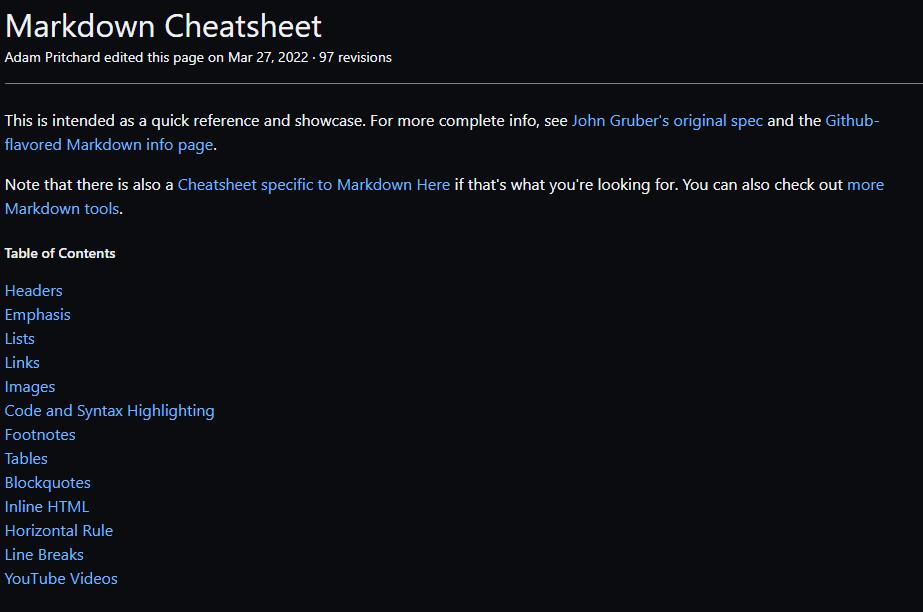

# Exemplo de README

Um projeto de teste com arquivo README 🚀


[](https://github.com/Rodrigo-FN)

## Tecnologias utilizadas
- HTML
- CSS
- JS

## Como utilizar

1 - Clone pro o projeto
```
    git clone <url>
```

2 - Acesse a pasta do projeto
```
cd curso-front-end-dev
```

## O que eu aprendi

[Markdown Cheatsheet](https://github.com/adam-p/markdown-here/wiki/Markdown-Cheatsheet)